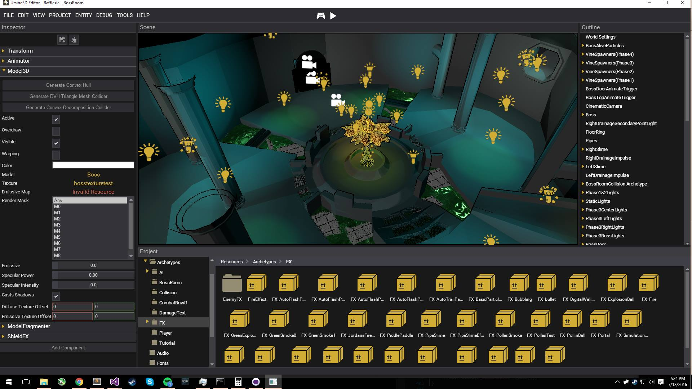

# Ursine 3D Game Engine  

  

## Overview  
Ursine 3D is a generalized game engine that was created for the GAM 300 & 350 classes at DigiPen Institute of Technology.  

## Features  
- In-Editor Level Editing, Play Mode, Content Management  
- C++ Entity Component System (ECS)  
- C++ Reflection  
- HTML/CSS/JS Support via Chromium Embedded Framework (CEF)  
- Extendable Content Pipeline  
- Full 3D Graphics Engine  
- Skeletal Animation (FK, IK, Blending, Procedural Motion)  
- In-Editor Animation Builder  
- Bullet Physics Integration  
- Wwise Audio Integration  

## Rafflesia  
With this engine, we created Rafflesia, a sci-fi co-op first-person shooter.  
[Trailer](https://www.youtube.com/watch?v=P0djeUhRbt0)  
[Download](https://games.digipen.edu/games/rafflesia#.Wvy7nIgvyCo)  
