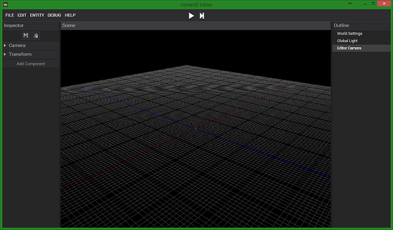
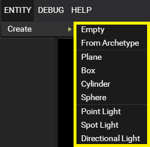

# Getting Started With The Ursine3D Engine

### What is an Entity and what is a Component
- An Entity is a collection of components. It represents an object in the world.
- A Component adds some functionality to an entity (ex: Model, Animator, Collider).

### Creating an Entity

### Adding Components

Things to cover:
- [CHECK] Adding entities
- Adding Components
- Tools
- Adding Models (fulle pipeline) + FBX Scene
- Adding Animations (full pipeline)
- Collision
- Saving / Loading archetypes
- Saving / Loading world's
- World setting object
